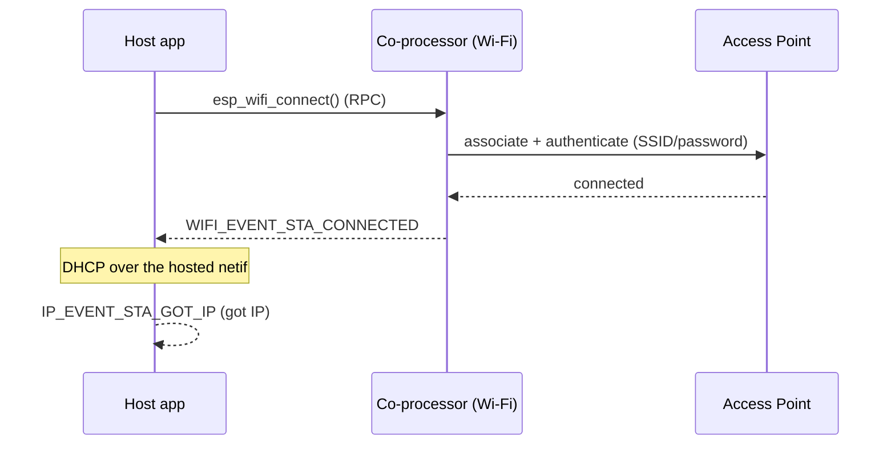

# Wi-Fi sta — Coprocessor

Connect to an AP as a Wi-Fi station with the radio on the **coprocessor** and the application on the **host**. The application is the upstream IDF `wifi/getting_started/station` example, byte-for-byte: `mcu_host/main/main.c` and `linux_802_3_host/c_app/main/main.c` are the same source as `~/esp-idf/examples/wifi/getting_started/station/main/station_example_main.c`. Same source, every host shape — that identity is the release bar for this tree.

## Supported Platforms and Transports

### Supported Coprocessors

| Coprocessor | ESP32 | ESP32-C Series | ESP32-S Series |
| :----------: | :---: | :------------: | :------------: |
| Support     | Yes   | Yes            | Yes            |

### Supported Host Devices

| Host Device | ESP32-P4 | ESP32-H2 | Other MCUs | Linux |
| :---------: | :------: | :------: | :--------: | :---: |
| Support     | Yes | Yes | [Yes](https://github.com/espressif/esp-hosted/blob/master/docs/getting-started-mcu.md) | [Yes](https://github.com/espressif/esp-hosted/blob/master/docs/getting-started-linux.md) |

### Supported Connection buses

| Connection bus | SDIO | SPI Full-Duplex | SPI Half-Duplex | UART |
| :------------- | :--: | :-------------: | :-------------: | :--: |
| Linux host     | Yes  | Yes             | No              | No   |
| MCU host       | Yes  | Yes             | Yes             | Yes  |

## Scenario

The host application drives Wi-Fi over the control path (RPC); the radio lives on the co-processor. On success the host's netif obtains an IP.



The Wi-Fi radio runs on the co-processor firmware — no extra option to enable. Select the transport:

```bash
cd examples/wifi/sta/cp
idf.py set-target esp32c6
idf.py menuconfig
```

```text
Component config
└── ESP-Hosted
     └── Configure coprocessor
          └── CP transport
               ├── Communication bus (co-processor <== bus ==> host)
               │    ├── ( ) SPI Full Duplex
               │    ├── (X) SDIO                    <── default
               │    ├── ( ) SPI Half Duplex         ← MCU host only
               │    └── ( ) UART                    ← MCU host only
               └── SDIO Configuration               ← clock, GPIOs, checksum (defaults OK)
```

Each bus has its own settings submenu (pins, clock, checksum) — defaults are fine for bring-up.

Wi-Fi is the default CP feature — no extra dependency config (`CONFIG_ESP_HOSTED_CP_FEAT_WIFI=y` is already set in `cp/sdkconfig.defaults`). Then flash and monitor:

```bash
idf.py -p <cp_usb_serial_port> flash monitor
```

<!-- generated from ../README.md — edit that file, not this one -->
