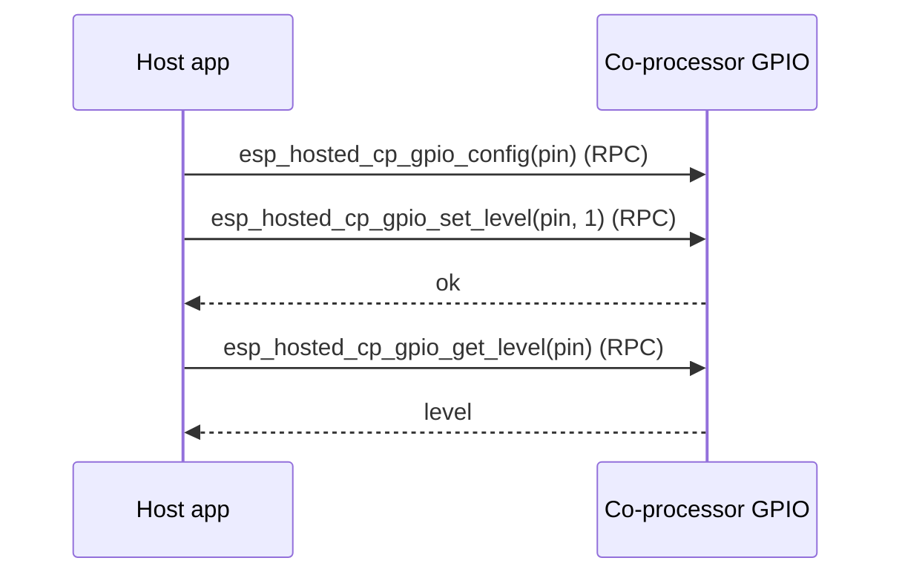

# gpio_expander — Host

Drives CP-side GPIOs from the host as if the coprocessor were a remote
GPIO expander. The host calls `esp_hosted_cp_gpio_*` (configure / set
level / get level / reset) over RPC; the CP applies each call to its
own `gpio_*` peripheral. Useful when the host MCU runs out of pins and
the coprocessor has spare ones.

## Supported Platforms and Transports

### Supported Coprocessors

| Coprocessor | ESP32 | ESP32-C Series | ESP32-S Series |
| :----------: | :---: | :------------: | :------------: |
| Support     | Yes   | Yes            | Yes            |

### Supported Host Devices

| Host Device | ESP32-P4 | ESP32-H2 | Other MCUs | Linux |
| :---------: | :------: | :------: | :--------: | :---: |
| Support     | Yes | Yes | [Yes](https://github.com/espressif/esp-hosted/blob/master/docs/getting-started-mcu.md) | [Yes](https://github.com/espressif/esp-hosted/blob/master/docs/getting-started-linux.md) |

### Supported Connection buses

| Connection bus | SDIO | SPI Full-Duplex | SPI Half-Duplex | UART |
| :------------- | :--: | :-------------: | :-------------: | :--: |
| Linux host     | Yes  | Yes             | No              | No   |
| MCU host       | Yes  | Yes             | Yes             | Yes  |

## Scenario

The host drives and reads the co-processor's GPIOs remotely over the control path (RPC).



Select the transport (must match the co-processor):

```bash
cd examples/gpio_expander/mcu_host
idf.py set-target esp32p4
idf.py menuconfig
```

```text
Component config
└── ESP-Hosted
     └── Configure host
          └── Host transport
               ├── Communication bus (co-processor <== bus ==> host)
               │    ├── ( ) SPI Full Duplex
               │    ├── (X) SDIO                    <── default (match the co-processor)
               │    ├── ( ) SPI Half Duplex
               │    └── ( ) UART
               └── SDIO Configuration               ← slot, bus width, GPIOs (defaults OK)
```

The host GPIO-expander feature is enabled by `sdkconfig.defaults`
(`ESP_HOSTED_HOST_FEAT_GPIO_EXP`); this host has no example-specific menu.
The CP-side pin under test (default GPIO 2) is set in code via
`SLAVE_GPIO_PIN`.

The Host dependency config is **pre-set in `sdkconfig.defaults`** (do not remove):

```text
CONFIG_ESP_HOSTED_HOST_FEAT_GPIO_EXP=y         # host GPIO-expander feature
CONFIG_ESP_HOSTED_HOST_FEAT_RPC=y              # RPC control path
CONFIG_ESP_HOSTED_HOST_FEAT_RPC_EXT_V2=y       # required RPC ext-v2
CONFIG_ESP_HOSTED_HOST_FEAT_SYSTEM=y           # system RPC calls
```

Then flash and monitor:

```bash
idf.py -p <host_usb_serial_port> flash monitor
```

<!-- generated from ../README.md — edit that file, not this one -->
