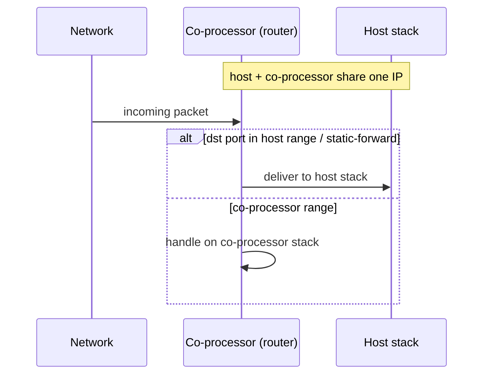

# network_split / station — Coprocessor

Bare-bones Wi-Fi station with the network-split netif backend wired in.
Wi-Fi sits on the coprocessor; the host runs its own LWIP / Linux-kernel
TCP/IP stack and the CP forwards 802.3 frames into the host netif. The
two stacks share one IP but split the port space — host owns 49152–61439,
CP owns 61440–65535. Use this when you want the smallest possible
connect-and-go to validate the split.

## Supported Platforms and Transports

### Supported Coprocessors

| Coprocessor | ESP32 | ESP32-C Series | ESP32-S Series |
| :----------: | :---: | :------------: | :------------: |
| Support     | Yes   | Yes            | Yes            |

### Supported Host Devices

| Host Device | ESP32-P4 | ESP32-H2 | Other MCUs | Linux |
| :---------: | :------: | :------: | :--------: | :---: |
| Support     | Yes | Yes | [Yes](https://github.com/espressif/esp-hosted/blob/master/docs/getting-started-mcu.md) | [Yes](https://github.com/espressif/esp-hosted/blob/master/docs/getting-started-linux.md) |

### Supported Connection buses

| Connection bus | SDIO | SPI Full-Duplex | SPI Half-Duplex | UART |
| :------------- | :--: | :-------------: | :-------------: | :--: |
| Linux host     | Yes  | Yes             | No              | No   |
| MCU host       | Yes  | Yes             | Yes             | Yes  |

## Scenario

Host and co-processor share one IP; the co-processor's router decides, per packet, which stack should handle it.



Enable **Network Split** and select the transport via `idf.py menuconfig`:

```bash
cd examples/network_split/station/cp
idf.py set-target esp32c6
idf.py menuconfig
```

```text
Component config
└── ESP-Hosted
     └── Configure coprocessor
          └── CP transport
               ├── Communication bus (co-processor <== bus ==> host)
               │    ├── ( ) SPI Full Duplex
               │    ├── (X) SDIO                    <── default
               │    ├── ( ) SPI Half Duplex         ← MCU host only
               │    └── ( ) UART                    ← MCU host only
               └── SDIO Configuration               ← clock, GPIOs, checksum (defaults OK)
```

The shipped defaults leave Network Split commented out — enable it and
its port / routing rules under **Features**:

```text
Component config
└── ESP-Hosted
     └── Configure coprocessor
          └── Features
               └── [*] Network Split
                    ├── [*] Auto-initialise Network Split at boot
                    ├── [*] Auto-connect WiFi on STA_START (network split)
                    ├── Default network stack for unfiltered packets
                    │    ├── (X) Coprocessor network stack                              <── default
                    │    ├── ( ) Host network stack
                    │    └── ( ) Replicate the packet towards both network stacks (Non recommended)
                    ├── Default DHCP client location
                    │    ├── ( ) Use DHCP at co-processor
                    │    ├── ( ) Use DHCP at Host
                    │    └── (X) Use DHCP at Both sides                                 <── default
                    ├── Slave side (local) LWIP port range (static)
                    │    ├── (61440) Slave TCP start port
                    │    ├── (65535) Slave TCP end port
                    │    ├── (61440) Slave UDP start port
                    │    └── (65535) Slave UDP end port
                    ├── Host side (remote) LWIP port range (static)
                    │    ├── (49152) Host TCP start port
                    │    ├── (61439) Host TCP end port
                    │    ├── (49152) Host UDP start port
                    │    └── (61439) Host UDP end port
                    ├── [*] Configure extra ports dedicated for host network stack
                    └── Host only ports
                         ├── ()        Host reserved TCP source ports
                         ├── (22,8554) Host reserved TCP destination ports
                         ├── ()        Host reserved UDP source ports
                         └── ()        Host reserved UDP destination ports
```

Each bus has its own settings submenu (pins, clock, checksum) — defaults are fine for bring-up.

The CP dependency config is **pre-set in `sdkconfig.defaults`** (do not remove) — note Network Split itself is *not* pre-set and must be enabled in menuconfig:

```text
CONFIG_ESP_HOSTED_CP_FEAT_WIFI=y               # Wi-Fi radio on the CP
CONFIG_BT_ENABLED=n                            # BT off
# CONFIG_ESP_HOSTED_CP_FEAT_NW_SPLIT=y         # NOT pre-set — enable in menuconfig
```

Then flash and monitor:

```bash
idf.py -p <cp_usb_serial_port> flash monitor
```

<!-- generated from ../README.md — edit that file, not this one -->
