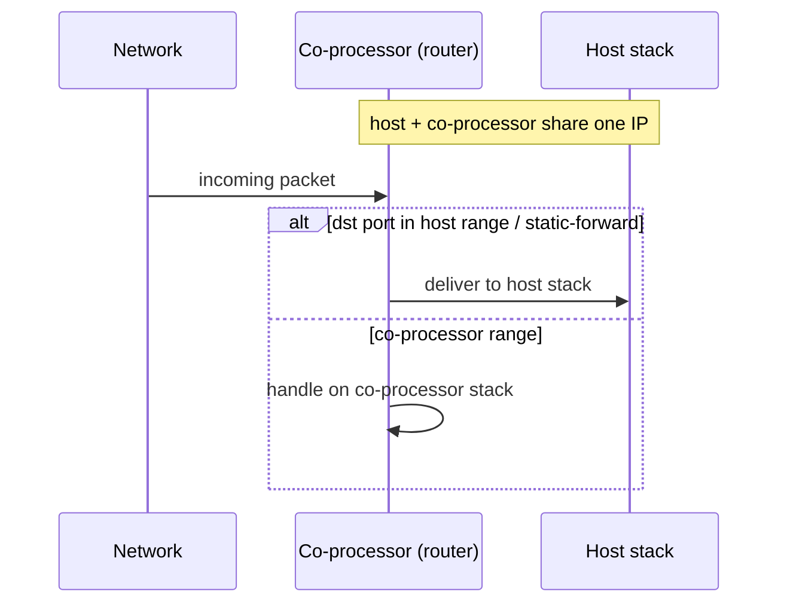

# network_split / station — Host

Bare-bones Wi-Fi station with the network-split netif backend wired in.
Wi-Fi sits on the coprocessor; the host runs its own LWIP / Linux-kernel
TCP/IP stack and the CP forwards 802.3 frames into the host netif. The
two stacks share one IP but split the port space — host owns 49152–61439,
CP owns 61440–65535. Use this when you want the smallest possible
connect-and-go to validate the split.

## Supported Platforms and Transports

### Supported Coprocessors

| Coprocessor | ESP32 | ESP32-C Series | ESP32-S Series |
| :----------: | :---: | :------------: | :------------: |
| Support     | Yes   | Yes            | Yes            |

### Supported Host Devices

| Host Device | ESP32-P4 | ESP32-H2 | Other MCUs | Linux |
| :---------: | :------: | :------: | :--------: | :---: |
| Support     | Yes | Yes | [Yes](https://github.com/espressif/esp-hosted/blob/master/docs/getting-started-mcu.md) | [Yes](https://github.com/espressif/esp-hosted/blob/master/docs/getting-started-linux.md) |

### Supported Connection buses

| Connection bus | SDIO | SPI Full-Duplex | SPI Half-Duplex | UART |
| :------------- | :--: | :-------------: | :-------------: | :--: |
| Linux host     | Yes  | Yes             | No              | No   |
| MCU host       | Yes  | Yes             | Yes             | Yes  |

## Scenario

Host and co-processor share one IP; the co-processor's router decides, per packet, which stack should handle it.



Select the transport (must match the co-processor):

```bash
cd examples/network_split/station/mcu_host
idf.py set-target esp32p4
idf.py menuconfig
```

```text
Component config
└── ESP-Hosted
     └── Configure host
          └── Host transport
               ├── Communication bus (co-processor <== bus ==> host)
               │    ├── ( ) SPI Full Duplex
               │    ├── (X) SDIO                    <── default (match the co-processor)
               │    ├── ( ) SPI Half Duplex
               │    └── ( ) UART
               └── SDIO Configuration               ← slot, bus width, GPIOs (defaults OK)
```

Set the AP credentials — the `mcu_host` app pulls them from
`protocol_examples_common`:

```text
Example WiFi Configuration
└── Uses EXAMPLE_WIFI_* symbols from protocol_examples_common
     (EXAMPLE_WIFI_SSID / EXAMPLE_WIFI_PASSWORD — defaults "myssid" / "mypassword")
```

The host Network-Split feature is enabled by `sdkconfig.defaults`; netif
ownership and host / CP port ranges live under **Features**:

```text
Component config
└── ESP-Hosted
     └── Configure host
          └── Features
               └── [*] Network Split
                    ├── [*] Auto-initialize Network-Split feature at boot
                    ├── Host-side STA netif ownership + IP source
                    │    ├── (X) External: app owns the netif                          <── default
                    │    ├── ( ) Internal + DHCP: nw_split creates netif, host runs DHCP
                    │    └── ( ) Internal + static: nw_split creates netif, CP provides IP
                    └── LWIP port config
                         ├── Host side (local) LWIP port config
                         │    ├── (49152) Host TCP start port
                         │    ├── (61439) Host TCP end port
                         │    ├── (49152) Host UDP start port
                         │    └── (61439) Host UDP end port
                         └── CP side (remote) LWIP port config
                              ├── (61440) CP TCP start port
                              ├── (65535) CP TCP end port
                              ├── (61440) CP UDP start port
                              └── (65535) CP UDP end port
```

The Host dependency config is **pre-set in `sdkconfig.defaults`** (do not remove):

```text
CONFIG_ESP_HOSTED_HOST_FEAT_NW_SPLIT=y         # host network-split netif backend
CONFIG_ESP_HOSTED_HOST_FEAT_WIFI=y             # host Wi-Fi control
CONFIG_ESP_HOSTED_HOST_FEAT_RPC=y              # RPC control path
CONFIG_ESP_HOSTED_HOST_FEAT_RPC_EXT_V2=y       # required RPC ext-v2
CONFIG_ESP_HOSTED_HOST_FEAT_SYSTEM=y           # system RPC calls
```

Then flash and monitor:

```bash
idf.py -p <host_usb_serial_port> flash monitor
```

<!-- generated from ../README.md — edit that file, not this one -->
