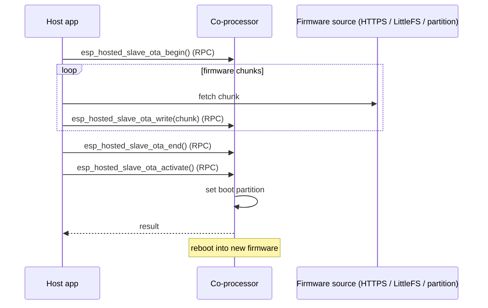

# ota / coprocessor_ota — Coprocessor

Pushes a new CP firmware image from the host through the OTA
begin / write / end / activate RPC chain. The host can source the image
from one of three places — HTTPS, an on-host LittleFS partition, or a
dedicated raw flash partition — selected at build time.

## Supported Platforms and Transports

### Supported Coprocessors

| Coprocessor | ESP32 | ESP32-C Series | ESP32-S Series |
| :----------: | :---: | :------------: | :------------: |
| Support     | Yes   | Yes            | Yes            |

### Supported Host Devices

| Host Device | ESP32-P4 | ESP32-H2 | Other MCUs | Linux |
| :---------: | :------: | :------: | :--------: | :---: |
| Support     | Yes | Yes | [Yes](https://github.com/espressif/esp-hosted/blob/master/docs/getting-started-mcu.md) | [Yes](https://github.com/espressif/esp-hosted/blob/master/docs/getting-started-linux.md) |

### Supported Connection buses

| Connection bus | SDIO | SPI Full-Duplex | SPI Half-Duplex | UART |
| :------------- | :--: | :-------------: | :-------------: | :--: |
| Linux host     | Yes  | Yes             | No              | No   |
| MCU host       | Yes  | Yes             | Yes             | Yes  |

## Scenario

The host streams new co-processor firmware over the control path using the four-call OTA RPC chain — `begin` → `write` (looped) → `end` → `activate`. (`activate` is a distinct RPC, needed on CP firmware v2.6.0+.) API names below are the example's compat surface (`esp_hosted_slave_ota_*`); the native equivalents are `eh_host_cp_ota_*`.



OTA runs on the co-processor's **System** feature (OTA / heartbeat / FW version), pre-enabled in `cp/sdkconfig.defaults` — you only select the transport:

```bash
cd examples/ota/coprocessor_ota/cp
idf.py set-target esp32c6
idf.py menuconfig
```

```text
Component config
└── ESP-Hosted
     └── Configure coprocessor
          └── CP transport
               ├── Communication bus (co-processor <== bus ==> host)
               │    ├── ( ) SPI Full Duplex
               │    ├── (X) SDIO                    <── default
               │    ├── ( ) SPI Half Duplex         ← MCU host only
               │    └── ( ) UART                    ← MCU host only
               └── SDIO Configuration               ← clock, GPIOs, checksum (defaults OK)
```

Each bus has its own settings submenu (pins, clock, checksum) — defaults are fine for bring-up.

CP dependency config is **pre-set in `cp/sdkconfig.defaults`** (do not remove):

```text
CONFIG_ESP_HOSTED_CP_FEAT_WIFI=y     # Wi-Fi — HTTPS OTA download path
CONFIG_BT_ENABLED=n
```

The System feature (OTA, heartbeat, FW version) is always enabled on the co-processor, so it needs no config.

Then flash and monitor:

```bash
idf.py -p <cp_usb_serial_port> flash monitor
```

<!-- generated from ../README.md — edit that file, not this one -->
