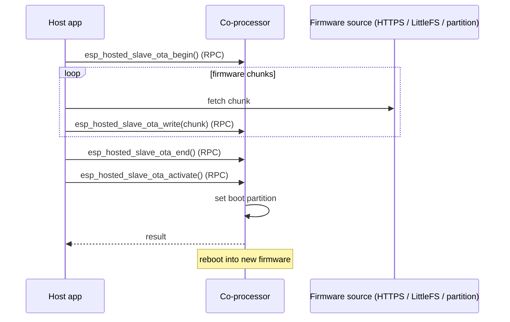

# ota / coprocessor_ota — Host

Pushes a new CP firmware image from the host through the OTA
begin / write / end / activate RPC chain. The host can source the image
from one of three places — HTTPS, an on-host LittleFS partition, or a
dedicated raw flash partition — selected at build time.

## Supported Platforms and Transports

### Supported Coprocessors

| Coprocessor | ESP32 | ESP32-C Series | ESP32-S Series |
| :----------: | :---: | :------------: | :------------: |
| Support     | Yes   | Yes            | Yes            |

### Supported Host Devices

| Host Device | ESP32-P4 | ESP32-H2 | Other MCUs | Linux |
| :---------: | :------: | :------: | :--------: | :---: |
| Support     | Yes | Yes | [Yes](https://github.com/espressif/esp-hosted/blob/master/docs/getting-started-mcu.md) | [Yes](https://github.com/espressif/esp-hosted/blob/master/docs/getting-started-linux.md) |

### Supported Connection buses

| Connection bus | SDIO | SPI Full-Duplex | SPI Half-Duplex | UART |
| :------------- | :--: | :-------------: | :-------------: | :--: |
| Linux host     | Yes  | Yes             | No              | No   |
| MCU host       | Yes  | Yes             | Yes             | Yes  |

## Scenario

The host streams new co-processor firmware over the control path using the four-call OTA RPC chain — `begin` → `write` (looped) → `end` → `activate`. (`activate` is a distinct RPC, needed on CP firmware v2.6.0+.) API names below are the example's compat surface (`esp_hosted_slave_ota_*`); the native equivalents are `eh_host_cp_ota_*`.



Select the transport (must match the co-processor) and pick the OTA method:

```bash
cd examples/ota/coprocessor_ota/mcu_host
idf.py set-target esp32p4
idf.py menuconfig
```

```text
Component config
└── ESP-Hosted
     └── Configure host
          └── Host transport
               ├── Communication bus (co-processor <== bus ==> host)
               │    ├── ( ) SPI Full Duplex
               │    ├── (X) SDIO                    <── default (match the co-processor)
               │    ├── ( ) SPI Half Duplex
               │    └── ( ) UART
               └── SDIO Configuration               ← slot, bus width, GPIOs (defaults OK)
```

```text
ESP-Hosted Coprocessor OTA Config
├── Select OTA Method
│     ├── (X) HTTP OTA                                   <── default
│     ├── ( ) LittleFS OTA
│     └── ( ) Partition OTA
│
├── WiFi Connection                                       ⎫
│     ├── (MyWiFiSSID) WiFi SSID                          │
│     └── (········)   WiFi Password                      │
├── HTTPS OTA Configuration                               ⎬  HTTP OTA method
│     ├── (…/firmware.bin) OTA Server URL                 │
│     ├── (30000) HTTPS connection timeout (ms)           │
│     └── [ ] Use self-signed certificate (testing only)  ⎭
│
├── (slave_fw) Partition Label                            ←  Partition OTA method
├── [*] Delete OTA file after flashing                    ←  LittleFS OTA method
│
└── OTA Verification Options
      ├── [*] Host-Slave version compatibility check
      └── [*] Skip OTA if slave firmware versions match
```

Host dependency config is **pre-set in `mcu_host/sdkconfig.defaults`** (do not remove):

```text
CONFIG_ESP_HOSTED_HOST_FEAT_WIFI=y   # Wi-Fi — HTTPS OTA download path
```

Then flash and monitor:

```bash
idf.py -p <host_usb_serial_port> flash monitor
```

<!-- generated from ../README.md — edit that file, not this one -->
