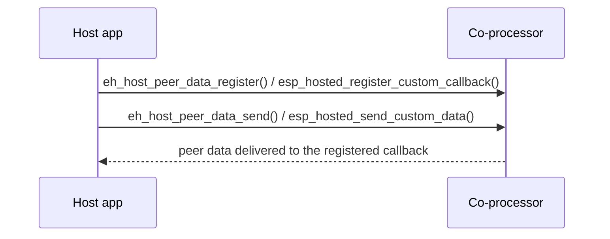

# peer_data_transfer — Host

Demonstrates the `peer_data` custom-RPC channel: the host sends
arbitrary application-defined messages identified by a `uint32_t`
message ID, the CP echoes them back on a paired response ID, and the
host verifies the payload round-tripped intact. The example exercises
the full supported size range (1 byte → 8166 bytes) and also fires a
deliberately-unregistered ID to confirm the framework rejects it
gracefully.

Message-ID pairs used by the demo:

- `MSG_ID_CAT` / `MSG_ID_MEOW` — 1–1000 bytes (small).
- `MSG_ID_DOG` / `MSG_ID_WOOF` — 1000–4000 bytes (medium).
- `MSG_ID_HUMAN` / `MSG_ID_HELLO` — 4000–8166 bytes (large).
- `MSG_ID_GHOST` — exceeds the configured callback table; expected
  to fail.

## Supported Platforms and Transports

### Supported Coprocessors

| Coprocessor | ESP32 | ESP32-C Series | ESP32-S Series |
| :----------: | :---: | :------------: | :------------: |
| Support     | Yes   | Yes            | Yes            |

### Supported Host Devices

| Host Device | ESP32-P4 | ESP32-H2 | Other MCUs | Linux |
| :---------: | :------: | :------: | :--------: | :---: |
| Support     | Yes | Yes | [Yes](https://github.com/espressif/esp-hosted/blob/master/docs/getting-started-mcu.md) | [Yes](https://github.com/espressif/esp-hosted/blob/master/docs/getting-started-linux.md) |

### Supported Connection buses

| Connection bus | SDIO | SPI Full-Duplex | SPI Half-Duplex | UART |
| :------------- | :--: | :-------------: | :-------------: | :--: |
| Linux host     | Yes  | Yes             | No              | No   |
| MCU host       | Yes  | Yes             | Yes             | Yes  |

## Scenario

The host registers a receive callback, sends application-defined data to the co-processor over the custom-data channel, and receives peer data back through the callback.



Select the transport (must match the co-processor):

```bash
cd examples/peer_data_transfer/mcu_host
idf.py set-target esp32p4
idf.py menuconfig
```

```text
Component config
└── ESP-Hosted
     └── Configure host
          └── Host transport
               ├── Communication bus (co-processor <== bus ==> host)
               │    ├── ( ) SPI Full Duplex
               │    ├── (X) SDIO                    <── default (match the co-processor)
               │    ├── ( ) SPI Half Duplex
               │    └── ( ) UART
               └── SDIO Configuration               ← slot, bus width, GPIOs (defaults OK)
```

```text
Example Configuration
└── [ ] Use legacy esp_hosted_* compat-surface main    <── default off
```

The host Peer-Data feature is enabled by `sdkconfig.defaults`; the
callback-table size lives under **Features**:

```text
Component config
└── ESP-Hosted
     └── Configure host
          └── Features
               └── [*] Peer Data Transfer
                    ├── [*] Auto-initialize Peer-Data feature at boot
                    └── (3) Maximum custom message handlers      (range 1–32)
```

The Host dependency config is **pre-set in `sdkconfig.defaults`** (do not remove):

```text
CONFIG_ESP_HOSTED_HOST_FEAT_PEER_DATA=y        # host peer-data (custom RPC) feature
```

(RPC + SYSTEM host features are default-on and need no explicit entry.)

Then flash and monitor:

```bash
idf.py -p <host_usb_serial_port> flash monitor
```

<!-- generated from ../README.md — edit that file, not this one -->
