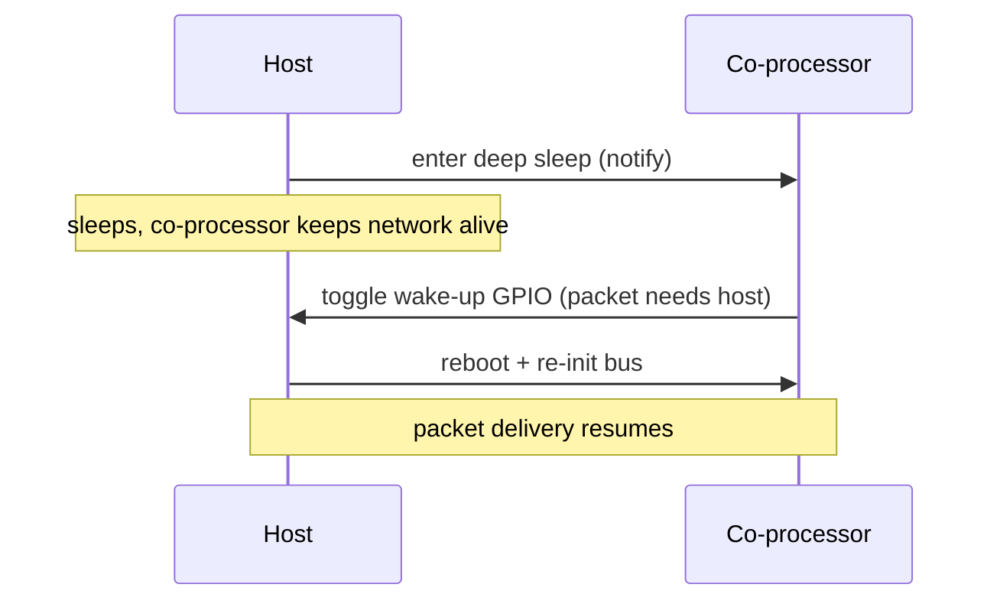

# power_save / host / network_split__host_deep_sleep — Coprocessor

Network split lets the CP keep Wi-Fi alive and own low-port traffic
(61440–65535) while the host enters **deep sleep**. The CP wakes the
host over a dedicated GPIO only when a packet hits a host-owned port
(49152–61439) or when a slave-side `wake-up-host` is issued. Drops
host idle current to RTC-only levels.

The host project lives under `esp_host/` rather than `mcu_host/` —
the deep-sleep wiring (esp_pm, RTC GPIO wake source, wifi-cmd + iperf
managed components) is ESP-IDF-only.

## Supported Platforms and Transports

### Supported Coprocessors

| Coprocessor | ESP32 | ESP32-C Series | ESP32-S Series |
| :----------: | :---: | :------------: | :------------: |
| Support     | Yes   | Yes            | Yes            |

### Supported Host Devices

| Host Device | ESP32-P4 | ESP32-H2 | Other MCUs | Linux |
| :---------: | :------: | :------: | :--------: | :---: |
| Support     | Yes | Yes | [Yes](https://github.com/espressif/esp-hosted/blob/master/docs/getting-started-mcu.md) | [Yes](https://github.com/espressif/esp-hosted/blob/master/docs/getting-started-linux.md) |

### Supported Connection buses

| Connection bus | SDIO | SPI Full-Duplex | SPI Half-Duplex | UART |
| :------------- | :--: | :-------------: | :-------------: | :--: |
| Linux host     | Yes  | Yes             | No              | No   |
| MCU host       | Yes  | Yes             | Yes             | Yes  |

## Scenario

The host sleeps while the co-processor keeps the link alive, and is woken over a GPIO only when a packet needs it.



Select the transport and enable the CP-side Host Power Save feature so the CP wakes the host over a GPIO:

```bash
cd examples/power_save/host/network_split__host_deep_sleep/cp
idf.py set-target esp32c6
idf.py menuconfig
```

```text
Component config
└── ESP-Hosted
     └── Configure coprocessor
          └── CP transport
               ├── Communication bus (co-processor <== bus ==> host)
               │    ├── ( ) SPI Full Duplex
               │    ├── (X) SDIO                    <── default
               │    ├── ( ) SPI Half Duplex         ← MCU host only
               │    └── ( ) UART                    ← MCU host only
               └── SDIO Configuration               ← clock, GPIOs, checksum (defaults OK)
```

```text
Component config
└── ESP-Hosted
     └── Configure coprocessor
          └── Features
               └── [*] Host Power Save
                    └── [*] Allow host to enter deep sleep. Slave will wakeup host using GPIO when needed
                         └── Host deep sleep - wakeup config
                              ├── (2)  Slave out: Host wakeup GPIO     ← ESP32-C6 default
                              └── Host Wakeup GPIO Level
                                   ├── (X) High                        <── default
                                   └── ( ) Low
```

The host netif gets its IP from a CP-side DhcpDnsStatus event
(`CONFIG_ESP_HOSTED_HOST_FEAT_NW_SPLIT_NETIF_INTERNAL_STATIC=y`), and
`wifi-cmd` is the single connect owner — Hosted auto-connect /
auto-reconnect hooks are off in this example.

CP dependency config is **pre-set in `sdkconfig.defaults`** (do not remove):

```text
CONFIG_ESP_HOSTED_CP_FEAT_WIFI=y  # Wi-Fi stack on the CP, kept alive while the host sleeps
CONFIG_ESP_HOSTED_CP_FEAT_NW_SPLIT=y  # network-split backend — CP owns low-port (61440–65535) traffic
CONFIG_ESP_HOSTED_CP_FEAT_NW_SPLIT_WIFI_AUTO_CONNECT_ON_STA_START=n  # wifi-cmd is the single connect owner
CONFIG_ESP_HOSTED_CP_FEAT_HOST_PS=y  # Host Power Save — CP wakes the host over a GPIO
CONFIG_ESP_HOSTED_CP_FEAT_HOST_PS_DEEP_SLEEP=y  # let the host enter deep sleep
```

The **wake-up GPIO** pair is the key power-save dependency: the *Slave out: Host wakeup GPIO* takes its Kconfig default (GPIO 2 on ESP32-C6, shown above) and must be physically wired to the host-side *Host in: Host Wakeup GPIO*, with both `Host Wakeup GPIO Level` settings matching.

Then flash and monitor:

```bash
idf.py -p <cp_usb_serial_port> flash monitor
```

<!-- generated from ../README.md — edit that file, not this one -->
