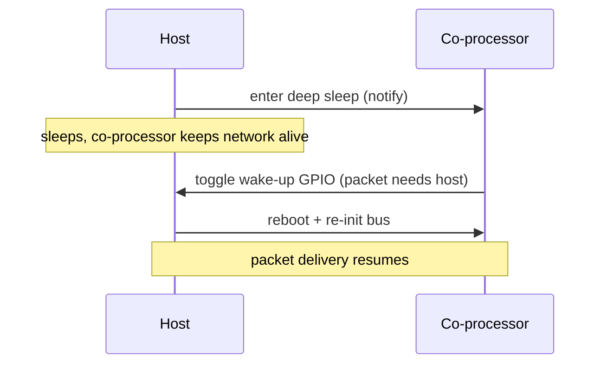

# power_save / host / network_split__host_deep_sleep — Host

Network split lets the CP keep Wi-Fi alive and own low-port traffic
(61440–65535) while the host enters **deep sleep**. The CP wakes the
host over a dedicated GPIO only when a packet hits a host-owned port
(49152–61439) or when a slave-side `wake-up-host` is issued. Drops
host idle current to RTC-only levels.

The host project lives under `esp_host/` rather than `mcu_host/` —
the deep-sleep wiring (esp_pm, RTC GPIO wake source, wifi-cmd + iperf
managed components) is ESP-IDF-only.

## Supported Platforms and Transports

### Supported Coprocessors

| Coprocessor | ESP32 | ESP32-C Series | ESP32-S Series |
| :----------: | :---: | :------------: | :------------: |
| Support     | Yes   | Yes            | Yes            |

### Supported Host Devices

| Host Device | ESP32-P4 | ESP32-H2 | Other MCUs | Linux |
| :---------: | :------: | :------: | :--------: | :---: |
| Support     | Yes | Yes | [Yes](https://github.com/espressif/esp-hosted/blob/master/docs/getting-started-mcu.md) | [Yes](https://github.com/espressif/esp-hosted/blob/master/docs/getting-started-linux.md) |

### Supported Connection buses

| Connection bus | SDIO | SPI Full-Duplex | SPI Half-Duplex | UART |
| :------------- | :--: | :-------------: | :-------------: | :--: |
| Linux host     | Yes  | Yes             | No              | No   |
| MCU host       | Yes  | Yes             | Yes             | Yes  |

## Scenario

The host sleeps while the co-processor keeps the link alive, and is woken over a GPIO only when a packet needs it.



Select the transport (must match the co-processor) and enable host power save with deep sleep:

```bash
cd examples/power_save/host/network_split__host_deep_sleep/esp_host
idf.py set-target esp32p4
idf.py menuconfig
```

```text
Component config
└── ESP-Hosted
     └── Configure host
          └── Host transport
               ├── Communication bus (co-processor <== bus ==> host)
               │    ├── ( ) SPI Full Duplex
               │    ├── (X) SDIO                    <── default (match the co-processor)
               │    ├── ( ) SPI Half Duplex
               │    └── ( ) UART
               └── SDIO Configuration               ← slot, bus width, GPIOs (defaults OK)
```

```text
Component config
└── ESP-Hosted
     └── Configure host
          └── Features
               └── [*] Allow host to power save
                    └── [*] Allow host to enter deep sleep. Slave will wakeup host using GPIO
                         ├── (6) Host in: Host Wakeup GPIO             ← ESP32-P4 EV-board default
                         └── Host Wakeup GPIO Level
                              ├── (X) High                             <── default
                              └── ( ) Low
```

The host-side `Host Wakeup GPIO Level` must match the slave-side setting above. Network-split port ranges (host 49152–61439 / CP 61440–65535) and the Wi-Fi extensions are preset in `sdkconfig.defaults`.

Host dependency config is **pre-set in `sdkconfig.defaults`** (do not remove):

```text
CONFIG_ESP_HOSTED_HOST_FEAT_WIFI=y  # host-side Wi-Fi (remote) API
CONFIG_ESP_HOSTED_HOST_FEAT_NW_SPLIT=y  # network-split on the host netif
CONFIG_ESP_HOSTED_HOST_FEAT_NW_SPLIT_NETIF_INTERNAL_STATIC=y  # host IP comes from the CP DhcpDnsStatus event
CONFIG_ESP_HOSTED_HOST_FEAT_POWER_SAVE=y  # host power-save feature
CONFIG_ESP_HOSTED_HOST_FEAT_POWER_SAVE_DEEP_SLEEP_ALLOWED=y  # allow host deep sleep (RTC-GPIO wake)
CONFIG_ESP_HOSTED_HOST_FEAT_WIFI_STA_AUTO_CONNECT_ON_START=n  # wifi-cmd owns connect (no auto-connect)
CONFIG_ESP_HOSTED_HOST_FEAT_WIFI_STA_AUTO_RECONNECT_ON_DISCONNECT=n  # no Hosted auto-reconnect
CONFIG_ESP_HOSTED_HOST_FEAT_WIFI_EXT_ITWT=y  # Wi-Fi iTWT extension
CONFIG_ESP_HOSTED_HOST_FEAT_WIFI_EXT_DPP=y  # Wi-Fi DPP extension
CONFIG_ESP_HOSTED_HOST_FEAT_WIFI_EXT_ENT=y  # Wi-Fi enterprise (EAP) extension
```

The host-side *Host in: Host Wakeup GPIO* (Kconfig default GPIO 6 on the ESP32-P4 EV-board, shown above) is the other half of the wake-up pair — wire it to the CP *Slave out* GPIO.

Then flash and monitor:

```bash
idf.py -p <host_usb_serial_port> flash monitor
```

<!-- generated from ../README.md — edit that file, not this one -->
