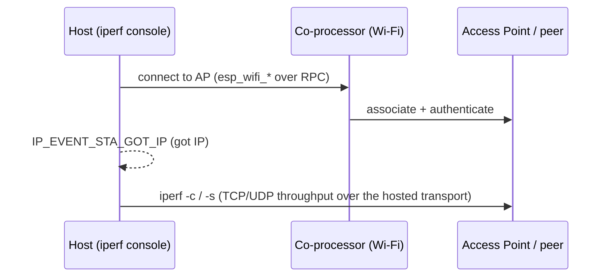

# Wi-Fi iperf — Coprocessor

Wi-Fi throughput benchmark. The Wi-Fi radio runs on the **coprocessor**; the **host** runs the upstream IDF `wifi/iperf` console app, with its `esp_wifi_*` calls routed to the coprocessor over ESP-Hosted. Associate with an AP, then drive TCP/UDP iperf from the console to measure end-to-end throughput across the hosted transport.

`mcu_host/main/iperf_example_main.c` is the upstream IDF `wifi/iperf` example, unchanged; the hosted layer adds only dependency wiring and throughput-tuned host `sdkconfig.defaults`.

## Supported Platforms and Transports

### Supported Coprocessors

| Coprocessor | ESP32 | ESP32-C Series | ESP32-S Series |
| :----------: | :---: | :------------: | :------------: |
| Support     | Yes   | Yes            | Yes            |

### Supported Host Devices

| Host Device | ESP32-P4 | ESP32-H2 | Other MCUs | Linux |
| :---------: | :------: | :------: | :--------: | :---: |
| Support     | Yes | Yes | [Yes](https://github.com/espressif/esp-hosted/blob/master/docs/getting-started-mcu.md) | [Yes](https://github.com/espressif/esp-hosted/blob/master/docs/getting-started-linux.md) |

### Supported Connection buses

| Connection bus | SDIO | SPI Full-Duplex | SPI Half-Duplex | UART |
| :------------- | :--: | :-------------: | :-------------: | :--: |
| Linux host     | Yes  | Yes             | No              | No   |
| MCU host       | Yes  | Yes             | Yes             | Yes  |

## Scenario

The host associates as a Wi-Fi station through the coprocessor, obtains an IP over the hosted netif, then drives iperf/ping from its console to benchmark the link.



The Wi-Fi radio runs on the co-processor firmware (`CONFIG_ESP_HOSTED_CP_FEAT_WIFI=y`, preset in `cp/sdkconfig.defaults`) — no extra option to enable. Select the transport (**SDIO** gives the best throughput):

```bash
cd examples/wifi/iperf/cp
idf.py set-target esp32c5
idf.py menuconfig
```

```text
Component config
└── ESP-Hosted
     └── Configure coprocessor
          └── CP transport
               ├── Communication bus (co-processor <== bus ==> host)
               │    ├── ( ) SPI Full Duplex
               │    ├── (X) SDIO                    <── default
               │    ├── ( ) SPI Half Duplex         ← MCU host only
               │    └── ( ) UART                    ← MCU host only
               └── SDIO Configuration               ← clock, GPIOs, checksum (defaults OK)
```

The CP dependency config is **pre-set in `cp/sdkconfig.defaults`** (do not remove):

```text
CONFIG_ESP_HOSTED_CP_FEAT_WIFI=y               # Wi-Fi (default CP feature)
CONFIG_BT_ENABLED=n                            # BT off (unused by this example)
```

Then flash and monitor:

```bash
idf.py -p <cp_usb_serial_port> flash monitor
```

<!-- generated from ../README.md — edit that file, not this one -->
