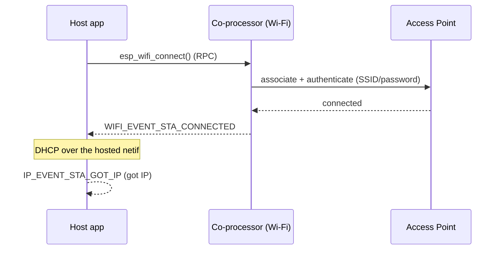

# Wi-Fi sta — Host

Connect to an AP as a Wi-Fi station with the radio on the **coprocessor** and the application on the **host**. The application is the upstream IDF `wifi/getting_started/station` example, byte-for-byte: `mcu_host/main/main.c` and `linux_802_3_host/c_app/main/main.c` are the same source as `~/esp-idf/examples/wifi/getting_started/station/main/station_example_main.c`. Same source, every host shape — that identity is the release bar for this tree.

## Supported Platforms and Transports

### Supported Coprocessors

| Coprocessor | ESP32 | ESP32-C Series | ESP32-S Series |
| :----------: | :---: | :------------: | :------------: |
| Support     | Yes   | Yes            | Yes            |

### Supported Host Devices

| Host Device | ESP32-P4 | ESP32-H2 | Other MCUs | Linux |
| :---------: | :------: | :------: | :--------: | :---: |
| Support     | Yes | Yes | [Yes](https://github.com/espressif/esp-hosted/blob/master/docs/getting-started-mcu.md) | [Yes](https://github.com/espressif/esp-hosted/blob/master/docs/getting-started-linux.md) |

### Supported Connection buses

| Connection bus | SDIO | SPI Full-Duplex | SPI Half-Duplex | UART |
| :------------- | :--: | :-------------: | :-------------: | :--: |
| Linux host     | Yes  | Yes             | No              | No   |
| MCU host       | Yes  | Yes             | Yes             | Yes  |

## Scenario

The host application drives Wi-Fi over the control path (RPC); the radio lives on the co-processor. On success the host's netif obtains an IP.



Select the transport (must match the co-processor) and set the AP credentials:

```bash
cd examples/wifi/sta/mcu_host
idf.py set-target esp32p4
idf.py menuconfig
```

```text
Component config
└── ESP-Hosted
     └── Configure host
          └── Host transport
               ├── Communication bus (co-processor <== bus ==> host)
               │    ├── ( ) SPI Full Duplex
               │    ├── (X) SDIO                    <── default (match the co-processor)
               │    ├── ( ) SPI Half Duplex
               │    └── ( ) UART
               └── SDIO Configuration               ← slot, bus width, GPIOs (defaults OK)
```

```text
Example Configuration
├── (myssid) WiFi SSID
├── (mypassword) WiFi Password
├── WPA3 SAE mode selection
│    ├── ( ) HUNT AND PECK
│    ├── ( ) H2E
│    └── (X) BOTH                            <── default
├── () PASSWORD IDENTIFIER                    ← SAE H2E / BOTH only
├── (5) Maximum retry
└── WiFi Scan auth mode threshold
     ├── ( ) OPEN
     ├── ( ) WEP
     ├── ( ) WPA PSK
     ├── (X) WPA2 PSK                         <── default
     ├── ( ) WPA/WPA2 PSK
     ├── ( ) WPA3 PSK
     ├── ( ) WPA2/WPA3 PSK
     └── ( ) WAPI PSK
```

Host dependency config is **pre-set in `mcu_host/sdkconfig.defaults`** (do not remove):

```text
CONFIG_ESP_HOSTED_HOST_FEAT_RPC=y          # RPC control path to the CP
CONFIG_ESP_HOSTED_HOST_FEAT_RPC_EXT_V2=y   # RPC ext-v2 wire (required)
CONFIG_ESP_HOSTED_HOST_FEAT_SYSTEM=y       # system RPCs
CONFIG_ESP_HOSTED_HOST_FEAT_WIFI=y         # host Wi-Fi feature — routes esp_wifi_* to the CP
```

Then flash and monitor:

```bash
idf.py -p <host_usb_serial_port> flash monitor
```

<!-- generated from ../README.md — edit that file, not this one -->
